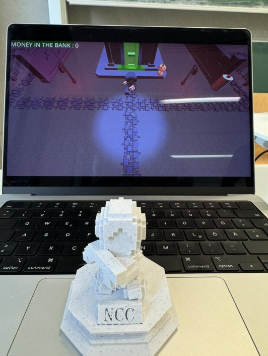
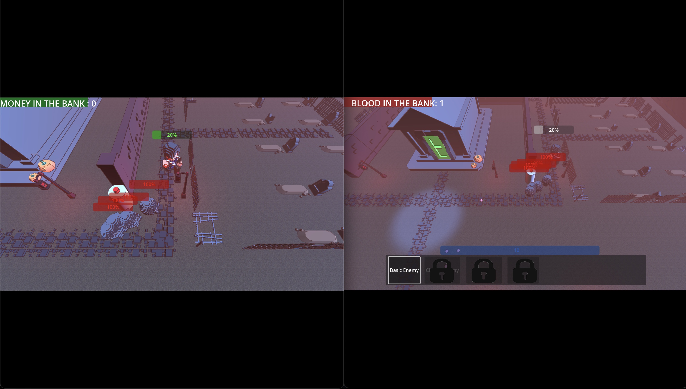

# Asymmetric 3D Multiplayer Twin Stick Shooter

This project was developed during the **Advanced Software Internship** at Heidelberg University under the supervision of Prof. Dr. Hesser.  
It was created by the **Neckar-Code-Collective** (Nathanael Meyer, Gianni Gagliardi, Daniel Berndt).

---

## Project Overview
The game is an **asymmetric multiplayer experience** that blends real-time strategy with twin stick shooter mechanics:

- One player acts as the **Mage**, summoning monsters, managing mana, and trying to stop the others.
- The remaining players are **Shooters**, fighting to survive, collect skulls, and eventually defeat the Mage.

The design combines elements of action, survival, and RTS, offering an innovative multiplayer experience.

---

## Features
- **Shooter gameplay**: WASD + Mouse/Gamepad for twin-stick movement and aiming, multiple weapons, pickups, money system.
- **Mage gameplay**: RTS-style top-down control, enemy spawning, mana & blood resource systems, upgradeable mobs.
- **Multiplayer Networking**: Peer-based synchronization using Godot RPCs, simple but robust to support unit testing.
- **Weapons & Items**: Abstract weapon system with modularity (e.g., AK-47, Flamethrower, Crossbow).
- **Enemies (Mobs)**: Zombie, Revenant, Charger, Hydra – each with unique AI and abilities.
- **Shops & Economy**: Money, upgrades, and progression systems.
- **Asymmetry**: Different win conditions for Mage and Shooters.

---

## Screenshots

### Gameplay 1

### Gameplay 2

---

## Technologies
- **Engine**: [Godot](https://godotengine.org/) (C# scripting)
- **Version Control**: GitHub (Organization: Neckar-Code-Collective)
- **Documentation**: Doxygen for code docs, UML & requirements docs
- **Workflow**: Trello, agile-inspired process with test-driven development

---

## Architecture
- **Entity-based design**: Common `Entity` base class for all units (players, enemies).
- **Health Component**: Tracks and replicates entity health.
- **Networked Transform**: Handles replication of positions & states across clients.
- **Weapon Component**: Manages inventory, shooting, and weapon switching.
- **Mage Manager**: Handles mana, mob spawning, and upgrades.

---

## Development Process
- Followed an **iterative agile approach**, similar to SCRUM.
- Key steps: idea discussion → requirements → task breakdown → prototyping → implementation → testing → review.
- Adopted **Test-Driven Development (TDD)** with GDUnit.
- Early large-scale prototypes shifted to **small-scale prototypes** for faster iteration.
- Continuous process improvements: clearer requirements, task verification, mandatory documentation.

---

## Controls

### Shooter
- **WASD** – Movement  
- **Mouse / Right Stick** – Aim  
- **Left Click / Trigger** – Shoot  
- **Mouse Wheel / Bumpers** – Switch weapon  
- **G** – Drop weapon  

### Mage
- **Mouse movement** – Pan view  
- **UI buttons** – Select mobs / upgrades  
- **Click world** – Spawn enemies  

---

Download the latest builds from the [Releases page](https://github.com/Neckar-Code-Collective/NCC-Project/releases). In the folder `buildmac/` you can find the executable for macOS, and in `buildwin/` you can find the equivalent for Windows (these folders are usually ignored in Git and distributed only via releases).
